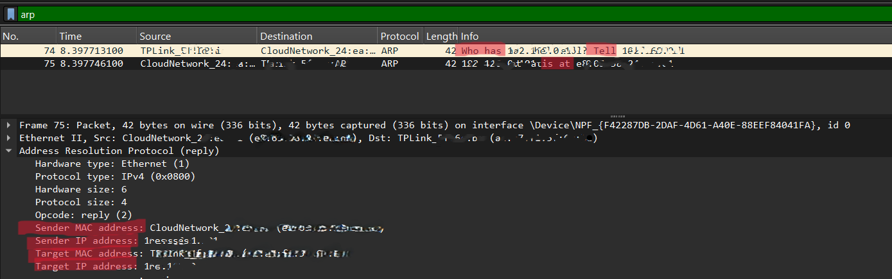

# Lab 7 – ARP

* **ARP (Address Resolution Protocol)**

## Objective

Understand how ARP (Address Resolution Protocol) is used to map an IP address to a MAC address on a local network.

## Steps

### 1. Start Wireshark

* Open **Wireshark**.
* Select your active network interface (Wi-Fi or Ethernet).
* Click the **Start Capturing Packets** button.

---

### 2. Clear the ARP Cache (Optional)

Clearing the ARP cache forces your computer to send new ARP requests, making them easier to capture.

**Windows**

Open **Command Prompt** as Administrator and run:

```bash
arp -d *
```

**Linux**

Open **Terminal** and run:

```bash
sudo ip neigh flush all
```

**macOS**

Open **Terminal** and run:

```bash
sudo arp -a -d
```

If you do not clear the ARP cache, the lab will still work, but your computer may already know the MAC addresses of nearby devices and may not send new ARP requests.

---

### 3. Generate ARP Traffic

After starting the packet capture, generate some network activity by doing one of the following:

* Open a website such as `https://google.com`.
* Ping your router (default gateway).
* Ping another device on your local network.

Example:

```bash
ping 192.168.1.1
```

(Replace `192.168.1.1` with your router's IP address if different.)

Wait a few seconds for packets to be captured.

---

### 4. Stop the Capture

* Return to Wireshark.
* Click the **Stop Capturing Packets** button (red square).

---

### 5. Apply the Display Filter

In the **Display Filter** box, type:

```
arp
```

Press **Enter**.

Only ARP packets will now be displayed.

---

## Questions

1. Which packet says **"Who has 192.168.x.x?"**
2. Which packet says **"Tell 192.168.x.x"**
3. What MAC address was returned?
4. How does ARP resolve an IP address into a MAC address?

## Answers

### [1] Which Packet Says "Who has 192.168.x.x?"

* Apply the display filter:

  ```
  arp
  ```

* Locate a packet whose **Info** column displays:

  ```
  Who has 192.168.x.x? Tell 192.168.x.x
  ```

* This is an **ARP Request**.

* It is broadcast to all devices on the local network asking:

  > "Which device owns this IP address?"

**Screenshot:**
<br/><br/> 


---

### [2] Which Packet Says "Tell 192.168.x.x"

* Locate the packet immediately following the ARP Request.

* The **Info** column should display something similar to:

  ```
  192.168.x.x is at 00:11:22:33:44:55
  ```

* This is an **ARP Reply**.

* It tells the requesting device:

  > "I own this IP address, and this is my MAC address."

**Screenshot:**
<br/><br/> 

---

### [3] What MAC Address Was Returned?

* Select the **ARP Reply** packet.

* Expand **Address Resolution Protocol** in the packet details.

* Locate the field:

  ```
  Sender MAC Address
  ```

* This is the MAC address associated with the requested IP address.

Example:

```
00:11:22:33:44:55
```

**Screenshot:**
<br/><br/> 

---

### [4] How Does ARP Resolve an IP Address into a MAC Address?

ARP works in two steps:

1. A device sends an **ARP Request** asking:

   ```
   Who has 192.168.x.x?
   ```

2. The device that owns that IP address responds with an **ARP Reply**:

   ```
   192.168.x.x is at 00:11:22:33:44:55
   ```

The sender stores this IP-to-MAC mapping in its **ARP Cache**, allowing future communication without sending another ARP request until the cache entry expires.

---

## Note
*  I have blurred my personal information, and the important details are highlighted.
  

---

## Learning

ARP (Address Resolution Protocol) is used only within a **Local Area Network (LAN)**. Since devices communicate using **MAC addresses** at the data-link layer, ARP translates an **IPv4 address** into the corresponding **MAC address** before data can be sent. Wireshark captures both **ARP Requests** ("Who has...?") and **ARP Replies** ("...is at..."), making it easy to observe how devices discover each other's hardware addresses on the network.
