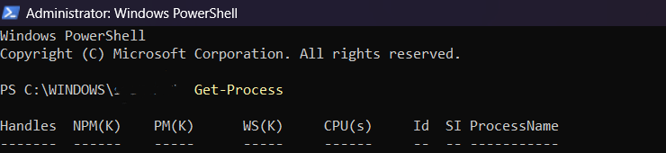
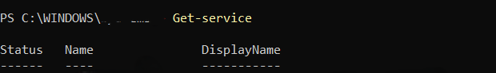
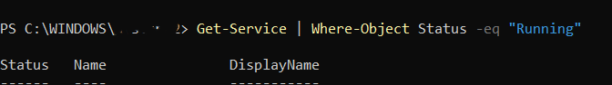
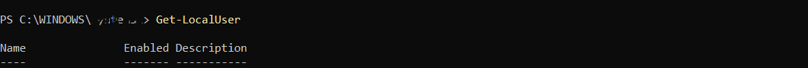
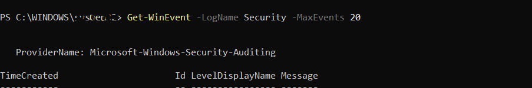

# **PowerShell — Windows Investigation**

Now we'll start investigating Windows using **PowerShell**.

## **1. Open PowerShell**

Open:

```powershell
PowerShell
```
* Type **PowerShell** in the Windows search box and select **Run as administrator**.
---

## **2. Get Running Processes**

Run:

```powershell
Get-Process
```

This displays the processes currently running on the Windows system.

You might see processes such as:

```text
chrome
explorer
powershell
svchost
```
**screenshot**
 <br/><br/> 


### **What does it do?**

`Get-Process` retrieves information about processes currently running on the computer.

---

## **3. Get Windows Services**

Run:

```powershell
Get-Service
```

This provides a PowerShell view of the Windows services installed on the system.

 <br/><br/> 

### **Show Only Running Services**

You can filter the results to display only services that are currently running:

```powershell
Get-Service | Where-Object Status -eq "Running"
```
 <br/><br/> 

### **What does this mean?**

* `Get-Service` → Retrieves Windows services.
* `|` → Sends the output to the next command.
* `Where-Object` → Filters the results.
* `Status -eq "Running"` → Shows only services whose status is **Running**.

---

## **4. Get Local Users**

Run:

```powershell
Get-LocalUser
```

This displays information about local user accounts on the Windows system.

You may see information such as:

```text
Name
Enabled
Description
LastLogon
PasswordRequired
```
<br/><br/> 

### **Why is this useful?**

This command can be useful during **account and Windows security investigations** because it helps identify local accounts and their status.

---

## **5. Get Security Events**

Run:

```powershell
Get-WinEvent -LogName Security -MaxEvents 20
```

This retrieves the **20 most recent events** from the Windows **Security** event log.

<br/><br/> 

### **What does it do?**

* `Get-WinEvent` → Retrieves events from Windows event logs.
* `-LogName Security` → Specifies the Security event log.
* `-MaxEvents 20` → Limits the output to the most recent 20 events.

> **Note:** Access to the Security event log may require PowerShell to be run with appropriate permissions, such as Administrator privileges.

---

# **6. Save PowerShell Output to Files**

You can save command output to text files using `Out-File`.

## **Save Running Processes**

```powershell
Get-Process | Out-File .\processes.txt
```

This saves the running-process information to:

```text
processes.txt
```

---

## **Save Services**

```powershell
Get-Service | Out-File .\services.txt
```

This saves the Windows service information to:

```text
services.txt
```

---

## **Save Local Users**

```powershell
Get-LocalUser | Out-File .\users.txt
```

This saves the local-user information to:

```text
users.txt
```

---

## **Save Security Events**

```powershell
Get-WinEvent -LogName Security -MaxEvents 20 | Out-File .\security-events.txt
```

This saves the 20 most recent Security events to:

```text
security-events.txt
```

---

# **7. Quick Reference**

| Investigation              | PowerShell Command                                                                     |
| -------------------------- | -------------------------------------------------------------------------------------- |
| **Running processes**      | `Get-Process`                                                                          |
| **All services**           | `Get-Service`                                                                          |
| **Running services**       | `Get-Service \| Where-Object Status -eq "Running"`                                     |
| **Local users**            | `Get-LocalUser`                                                                        |
| **Recent Security events** | `Get-WinEvent -LogName Security -MaxEvents 20`                                         |
| **Save processes**         | `Get-Process \| Out-File .\processes.txt`                                        |
| **Save services**          | `Get-Service \| Out-File .\services.txt`                                         |
| **Save users**             | `Get-LocalUser \| Out-File .\users.txt`                                          |
| **Save Security events**   | `Get-WinEvent -LogName Security -MaxEvents 20 \| Out-File .\dsecurity-events.txt` |

# **8. Summary**

In this exercise, you used PowerShell to investigate several important areas of Windows:

* **Processes** — identify programs currently running.
* **Services** — examine Windows services and filter running services.
* **Local users** — inspect local user accounts.
* **Security events** — review recent entries in the Security event log.
* **Output files** — save investigation results for later analysis.


# Note
 > **Note:** I have not included any personal information in the  outputs. I recommend running these commands in your own lab environment to see the results firsthand. The output format will be similar to the examples shown here, but the actual data will vary depending on your system and environment.

