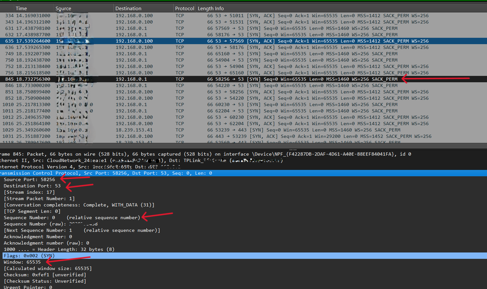
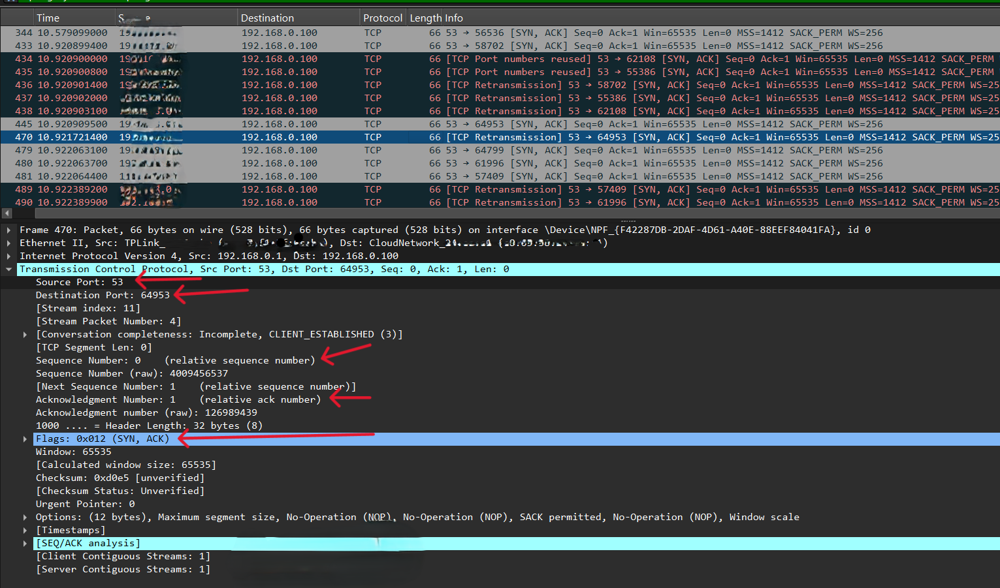
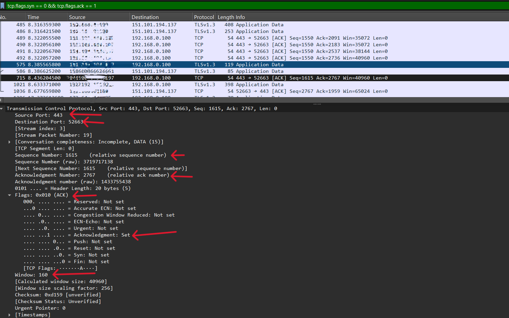

## Lab 2 – TCP Three-Way Handshake
* TCP (Transmission Control Protocol)

### Objective:

To understand how TCP connections are established by observing the TCP three-way handshake in Wireshark.

### Steps:

1. Open a website in a web browser, such as:

   * google.com
   * youtube.com

2. Start **Wireshark** and begin capturing the network traffic.

3. Apply the following display filter:
   `tcp`
   or
   `tcp.flags.syn == 1`

4. Identify the three packets involved in the TCP three-way handshake:

   * **SYN**
   * **SYN, ACK**
   * **ACK**

### TCP Three-Way Handshake

#### [1] SYN (Synchronize)

**Steps:**

* Open a web browser and visit a website, such as **google.com** or **youtube.com**.
* Start the Wireshark capture before opening the website.
* Stop the capture after the website loads.
* Apply the following display filter:
  `tcp.flags.syn == 1`
* Identify the **SYN** packet and note the following details:

  * **Source Port:** 58256
  * **Destination Port:** 53
  * **Sequence Number:** 0
  * **Window Size:** 65535
  * **Marked with red arrows**
     

**Note:** The values shown above are examples. The actual values may vary depending on your system and network. Enter the values displayed in your own Wireshark capture.

#### [2] SYN, ACK (Acknowledgment)

**Steps:**

* The first three steps are the same as for the **SYN** packet. Just change the display filter to:

  `tcp.flags.syn == 1 && tcp.flags.ack == 1`

* Identify the **SYN, ACK** packet and note the following details:

  * **Source Port:** 53
  * **Destination Port:** 64953
  * **Sequence Number:** 0
  * **Window Size:** 65535
  * **Acknowledgment Number:** 1
      
   **Note:** The values shown above are examples. The actual values may vary depending on your system and network. Enter the values displayed in your own Wireshark capture.

   #### [3] ACK (Acknowledgment)

  **Steps:**

* The first three steps are the same as for the **SYN** packet. Just change the display filter to:

  `tcp.flags.syn == 0 && tcp.flags.ack == 1`

* Identify the **ACK** packet and note the following details:

  * **Source Port:** 443
  * **Destination Port:** 52663
  * **Sequence Number:** 1615
  * **Window Size:** 160
  * **Acknowledgment Number:** 2767
  * **The details are marked with red arrows.**
      

  **Note:** The values shown above are examples. The actual values may vary depending on your system and network. Enter the values displayed in your own Wireshark capture.

  ## Questions and Answers

### 1. What is the Sequence Number?

The **Sequence Number** identifies the position of TCP data within a connection. During the three-way handshake, the **SYN** packet contains the client's initial sequence number, and the **SYN-ACK** packet contains the server's initial sequence number.

**Wireshark:**
TCP → Sequence Number → [Enter the value from your capture]

### 2. What is the Window Size?

The **Window Size** indicates how much data the receiver is currently willing to accept without receiving an acknowledgment.

**Wireshark:**
TCP → Window → [Enter the value from your capture]

### 3. Why is the TCP Three-Way Handshake Required?

The **TCP three-way handshake** is required to establish a reliable connection between the client and server and to synchronize their initial sequence numbers.

# Conclusion

In the TCP three-way handshake:

* **SYN** → “I want to establish a connection.”
* **SYN-ACK** → “I received your request and agree to establish the connection.”
* **ACK** → “I received your response. The connection is now established.”

