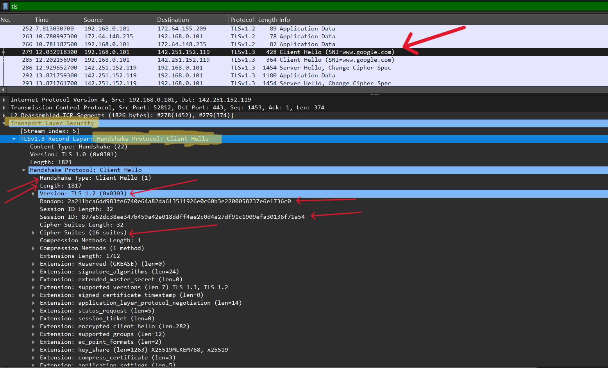
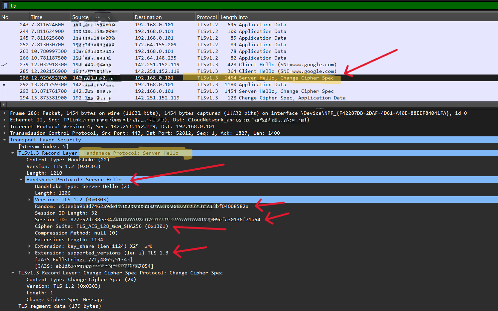

## Lab 3 – HTTPS / TLS

* TLS( Transport Layer Security )

### Objective:

To understand how secure HTTPS connections are established by observing the TLS handshake in Wireshark.

### Steps:

1. Open a web browser and visit secure websites such as:

   * gmail.com
   * github.com

2. Start **Wireshark** and begin capturing the network traffic.

3. After the websites finish loading, stop the packet capture.

4. Apply the following display filter: `tls`

5. Identify the TLS handshake packets:

   * **Client Hello**
   * **Server Hello**
   * **Certificate**

---

### TLS Handshake

#### [1] Client Hello

**Steps:**

* Open a web browser and visit **gmail.com** or **github.com**.
* Start the Wireshark capture before opening the website.
* Stop the capture after the website loads.
* Apply the following display filter:

  `tls.handshake.type == 1`

* Identify the **Client Hello** packet and note the following details:

  * **TLS Version Offered:** TLS 1.3
  * **Random:** 2a211bca...6c0
  * **Session ID:** 877e52d...a54
  * **Cipher Suites Offered:** 16 suites 
  * **Extensions:** Reserved, Supported versions, Signature Algorithms etc..
  * **Details are Marked with red arrows**

    

---

#### [2] Server Hello

**Steps:**

* The first three steps are the same as for the **Client Hello** packet. Just change the display filter to:

  `tls.handshake.type == 2`

* Identify the **Server Hello** packet and note the following details:

  * **TLS Version Selected:** TLS 1.3
  * **Cipher Suite:** TLS_AES_128... LIKE THIS
  * **Session ID (if present):** 877e...a54
  * **Details are Marked with red arrows**

    

---

#### [3] Server Certificate

**Steps:**

* The first three steps are the same as for the **Client Hello** packet. Just change the display filter to:

  `tls.handshake.type == 11`

* Identify the **Certificate** packet and note the following details:

  * **Certificate Subject:** *.google.com (or github.com)
  * **Certificate Issuer:** Google Trust Services / DigiCert (depends on the website)
  * **Public Key Algorithm:** RSA or ECDSA
  * **Signature Algorithm:** ecdsa-with-SHA256 (or similar)
  * **Validity Period:** Not Before / Not After

 * If packets appear, click one and expand Handshake Protocol: Certificate
 * If No packets match, the certificate handshake is encrypted (common with TLS 1.3).
  
 **Why can't I see the certificate?**

* With TLS 1.3, after the Server Hello, the server encrypts the remaining handshake messages, including:

- Certificate
- Certificate Verify
- Finished

* Wireshark cannot display these unless it has the session keys

---

### Questions

**1. Which TLS version is used?**

**Answer:** Check the **Server Hello** packet and note the **TLS Version** (for example, **TLS 1.3**).

---

**2. Which encryption cipher is negotiated?**

**Answer:** Check the **Server Hello** packet and note the selected **Cipher Suite** (for example, **TLS_AES_128_GCM_SHA256**).

---

**3. What is Cipher Suite?**
 **Answer:** The security method both the client and server agree to use for protecting the data they send to each other.

 ---

 **4. What is Server Certificate?**
 **Answer:** The server's digital certificate proving its identity and containing its public key.

 ---

 ### Note:
 The values shown in the examples above are mine. The actual values may vary depending on your system and network. Enter the values displayed in your own Wireshark capture.

 ---

### Conclusion

In the TLS handshake:

**Client Hello** → The client initiates a secure connection by sending the supported TLS versions, cipher suites, and extensions.

**Server Hello** → The server selects the TLS version and cipher suite that will be used for the secure session.

**Server Certificate** → The server provides its digital certificate to authenticate its identity and enable secure key exchange.

After these steps, both the client and server derive shared encryption keys, and all subsequent HTTPS communication is encrypted and protected.
