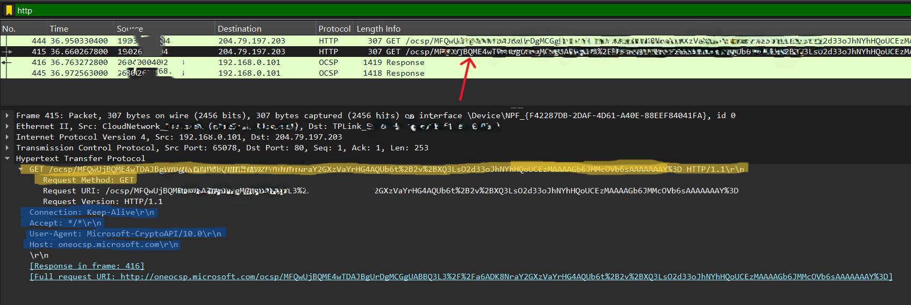
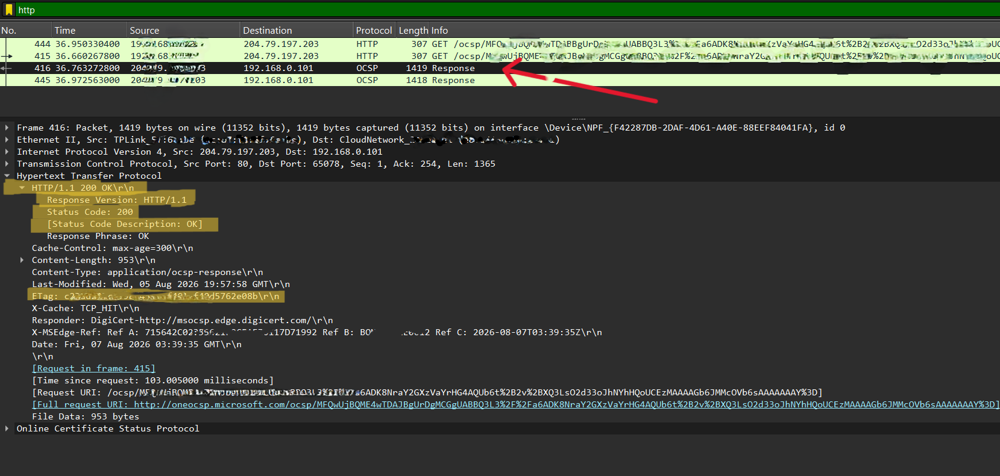

# Lab 4 – HTTP vs. HTTPS

* **HTTP (Hypertext Transfer Protocol)**
* **HTTPS (Hypertext Transfer Protocol Secure)**

## Objective

The objective of this lab is to capture and analyze HTTP and HTTPS network traffic using Wireshark, compare how data is transmitted in each protocol, identify HTTP requests, responses, status codes, and headers, and understand how HTTPS uses TLS encryption to secure web communication.

## Steps

### 1. Start Wireshark

Launch **Wireshark** and begin capturing network traffic.

### 2. Capture HTTP Traffic

Since most websites now use HTTPS, you can either:

* Visit an HTTP-only website (if available), or
* Use a local HTTP server.

**Option A (Recommended): Local HTTP Server**

If Python is installed on your system, start a local HTTP server by running the following command:

**Windows/Linux/macOS**

```bash
python -m http.server 8000
```

Open a web browser and navigate to:

```
http://localhost:8000
```

### 3. Stop the Packet Capture

After the page finishes loading, stop the packet capture in Wireshark.

### 4. Apply the HTTP Display Filter

Enter the following display filter:

```
http
```

### 5. Identify HTTP Packets

Locate the following packets in the capture:

* **HTTP GET request**
* **HTTP response**
* **HTTP status codes**

### 6. Observe an HTTP GET Request

Select a packet containing:

```
GET / HTTP/1.1
```

Expand the **Hypertext Transfer Protocol** section.

You should see information similar to the following:

```
GET / HTTP/1.1
Host: oneocsp.microsoft.com
User-Agent: microsoft-crypto
Accept: */*
Connection: keep-alive
```

**Explanation**

* **GET** – Requests a resource from the server.
* **Host** – Specifies the destination server.
* **User-Agent** – Identifies the browser or client sending the request.
* **Accept** – Specifies the content types that the client can accept.
* **Connection** – Indicates whether the TCP connection should remain open after the request.

<br/><br/> 

### 7. Observe an HTTP POST Request (Optional)

If you submit a form on an HTTP website, you may observe a request similar to:

```
POST /login HTTP/1.1
```

The request body may contain readable form data such as:

```
username=admin
password=12345
```

**Explanation**

* **POST** sends data from the client to the server.
* In HTTP, the request body is transmitted in plain text, making it readable in Wireshark.

### 8. Check the HTTP Response

The server typically replies with a response such as:

```
HTTP/1.1 200 OK
```

### Common HTTP Status Codes

| Status Code                   | Meaning                                                                  |
| ----------------------------- | ------------------------------------------------------------------------ |
| **200 OK**                    | The request was successful.                                              |
| **301 Moved Permanently**     | The requested resource has been permanently moved to a new URL.          |
| **302 Found**                 | The requested resource has been temporarily redirected.                  |
| **304 Not Modified**          | The cached version of the resource is still valid.                       |
| **400 Bad Request**           | The client sent an invalid request.                                      |
| **401 Unauthorized**          | Authentication is required to access the resource.                       |
| **403 Forbidden**             | The client does not have permission to access the resource.              |
| **404 Not Found**             | The requested resource could not be found.                               |
| **500 Internal Server Error** | The server encountered an unexpected error while processing the request. |

<br/><br/> 

### 9. Capture HTTPS Traffic

To capture HTTPS traffic in Wireshark, use the **`tls`** display filter because HTTPS traffic is carried over the **TLS (Transport Layer Security)** protocol. Follow the same procedure that was covered in **Lab 3**.


## Questions

### Q1. What is the difference between HTTP and HTTPS?

**Answer:**

HTTP (Hypertext Transfer Protocol) transfers data in plain text. As a result, anyone who intercepts the communication can read the transmitted information.

HTTPS (Hypertext Transfer Protocol Secure) uses TLS/SSL encryption to secure communication between the client and the server, protecting data from interception and tampering.

In Wireshark, HTTP packets are readable, whereas HTTPS traffic is encrypted. Without the appropriate TLS session keys, the application data cannot be viewed.

### Q2. What is the difference between GET and POST requests?

**Answer:**

| GET                                                       | POST                                                               |
| --------------------------------------------------------- | ------------------------------------------------------------------ |
| Retrieves data from the server.                           | Sends data to the server.                                          |
| Data is included in the URL.                              | Data is included in the request body.                              |
| Commonly used to retrieve web pages and other resources.  | Commonly used for form submissions, user logins, and file uploads. |
| Request details are visible in Wireshark when using HTTP. | Submitted data is also visible in Wireshark when using HTTP.       |

### Q3. What are HTTP status codes? Give some examples.

**Answer:**

HTTP status codes are three-digit numbers returned by a web server to indicate the outcome of a client's request.

Some common status codes are:

* **200 OK** – The request was processed successfully.
* **301 Moved Permanently** – The requested resource has been permanently moved to a different URL.
* **404 Not Found** – The requested resource could not be located.
* **500 Internal Server Error** – The server encountered an unexpected condition that prevented it from completing the request.

These status codes help clients determine whether a request was successful or identify the reason for a failure.

---

## Note

The values shown in the examples above were captured on my system. The actual values may vary depending on your operating system, browser, network configuration, and Wireshark capture. Record the values observed in your own packet capture.

---

## Conclusion

* HTTP transmits data in plain text, allowing Wireshark to display requests, responses, headers, URLs, and transmitted data.
* HTTPS uses TLS encryption to protect application data. Although Wireshark can display the TLS handshake and certificate exchange, the HTTP requests, responses, and payload remain encrypted unless the appropriate TLS session keys are available.
* GET requests are used to retrieve resources, whereas POST requests are used to send data to a server.
* HTTP status codes indicate the outcome of a request, while HTTP headers provide metadata that enables efficient communication between the client and the server.
