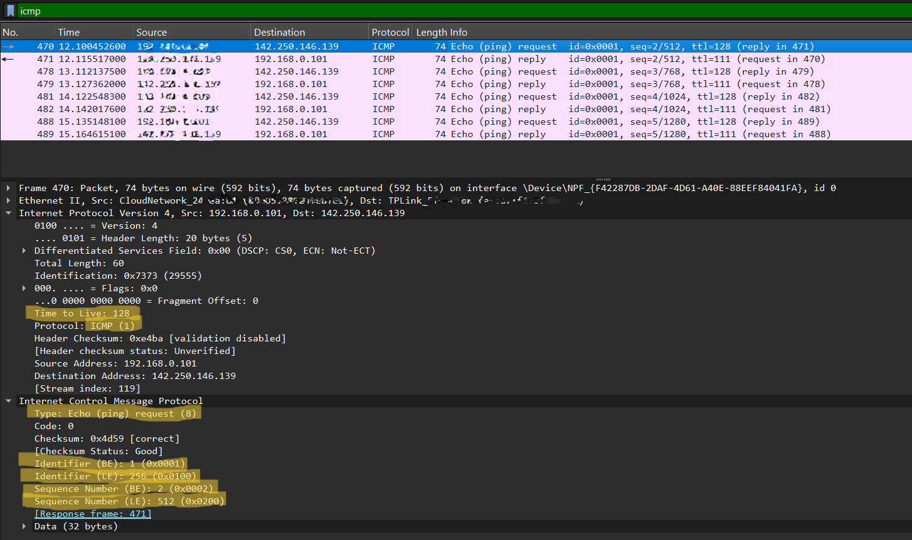
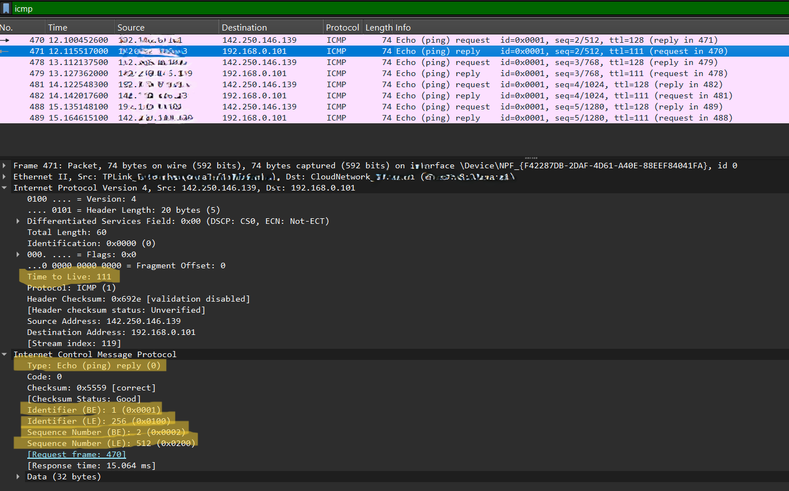
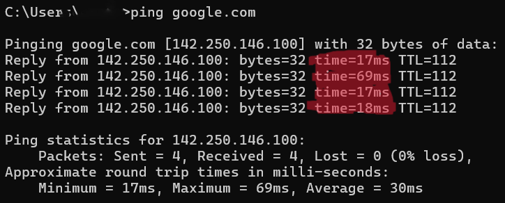

# Lab 5 – ICMP (Ping)

* **ICMP (Internet Control Message Protocol)**

## Objective

Understand how ICMP works by capturing and analyzing **Echo Request** and **Echo Reply** packets generated by the `ping` command.

## Steps

1. Start **Wireshark**.

2. Open **Command Prompt** (Windows) or **Terminal** (Linux/macOS).

3. Run the following command in terminal:

   ```bash
   ping google.com
   ```

4. Stop the capture after the ping completes.

5. Apply the Display Filter:

   ```
   icmp
   ```

## Questions

1. Which packet is the **Echo Request**?
2. Which packet is the **Echo Reply**?
3. What was the **TTL (Time To Live)** value?
4. What was the **Round-Trip Time (RTT)**?

## Answers

### [1] Which Packet is the Echo Request?

* Apply the following display filter:

  ```
  icmp
  ```

* In the packet list, locate a packet whose **Info** column shows:

  ```
  Echo (ping) request
  ```

* Select the packet.

* Expand **Internet Control Message Protocol** in the packet details.

* Verify that the packet has:

  * **Type = 8 (Echo Request)**
  * **Code = 0**

**Screenshot:**
<br/><br/> 

---

### [2] Which Packet is the Echo Reply?

* Locate the packet immediately following the Echo Request.

* The **Info** column should display:

  ```
  Echo (ping) reply
  ```

* Select the packet.

* Expand **Internet Control Message Protocol**.

* Verify that the packet has:

  * **Type = 0 (Echo Reply)**
  * **Code = 0**

**Screenshot:**
<br/><br/> 

---

### [3] What Was the TTL (Time To Live) Value?

* Select either the Echo Request or Echo Reply packet.

* Expand **Internet Protocol Version 4 (IPv4)**.

* Locate the field:

  ```
  Time to Live (TTL)
  ```

* Note the TTL value.

  **Example:**

  ```
  TTL = 117
  ```
* you will find `TTL` in Internet protocol section.

---

### [4] What Was the Round-Trip Time (RTT)?

* Run the following command:

  ```bash
  ping google.com
  ```

* In the Command Prompt or Terminal, observe the reply:

  ```
  Reply from 142.250.xxx.xxx:
  bytes=32 time=18ms TTL=117
  ```

* The value after **time=** is the **Round-Trip Time (RTT)**.

* You can also calculate RTT in Wireshark by comparing the timestamps of the matching Echo Request and Echo Reply packets.

**Screenshot:**
<br/><br/> 

---

## Learning

ICMP (Internet Control Message Protocol) is used for network diagnostics and error reporting. The **ping** command sends an **Echo Request** to a destination host, which responds with an **Echo Reply** if reachable. By analyzing ICMP packets in Wireshark, you can determine network connectivity, observe the **TTL (Time To Live)** value, and measure the **Round-Trip Time (RTT)** between two devices.
