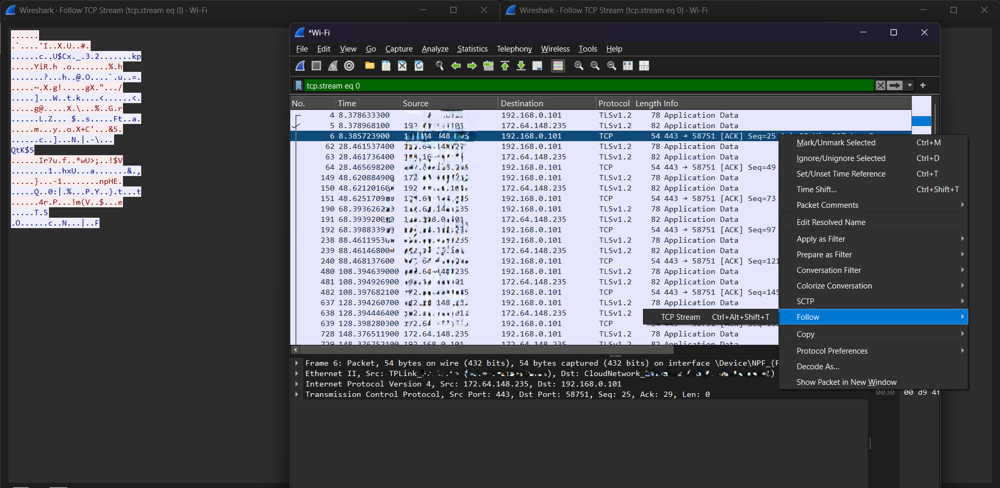
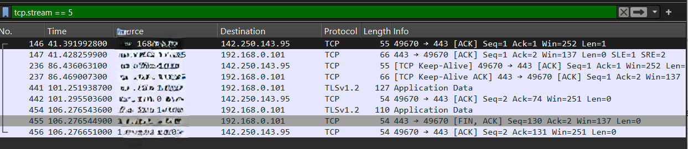

# Lab 7 – Follow TCP Stream

* **TCP (Transmission Control Protocol)**

## Objective

Learn how to use Wireshark's **Follow TCP Stream** feature to view the complete conversation between a client and a server.

## Steps

### 1. Start Wireshark

* Open **Wireshark**.
* Select your active network interface (Wi-Fi or Ethernet).
* Click the **Start Capturing Packets** button.

---

### 2. Generate TCP Traffic

Open a web browser and visit any website, for example:

* `https://google.com`
* `https://github.com`
* `https://example.com`

Wait until the website loads completely.

---

### 3. Stop the Capture

* Return to Wireshark.
* Click the **Stop Capturing Packets** button (red square).

---

### 4. Find a TCP Packet

In the **Display Filter** box, type:

```
tcp
```

Press **Enter**.

You will now see only TCP packets.

Choose any TCP packet belonging to the website you visited. A packet with **Protocol = TCP** is sufficient.

---

### 5. Follow the TCP Stream

* Right-click the selected TCP packet.
* Choose:

```
Follow → TCP Stream
```

A new window will open displaying the complete TCP conversation between your computer (client) and the web server.

---

## Questions

1. What is the complete TCP conversation?
2. What requests were sent by the client?
3. What responses were sent by the server?
4. What is the Stream Index?

## Answers

### [1] What is the Complete TCP Conversation?

* After selecting **Follow → TCP Stream**, a new window appears.
* This window combines all packets that belong to the same TCP connection.
* Instead of viewing individual packets, you see the complete communication in order.

For websites using **HTTPS**, the data will appear encrypted and may not be human-readable.

**Screenshot:**
<br/><br/> 


---

### [2] What Requests Were Sent by the Client?

* In the TCP Stream window, identify the data sent from your computer.
* By default:

  * **Red** text usually represents data sent by the **client**.
  * **Blue** text usually represents data sent by the **server**.

If the connection is unencrypted (HTTP), you may see requests such as:

```
GET / HTTP/1.1
Host: example.com
User-Agent: Mozilla/5.0
```

If the website uses HTTPS (such as Google or GitHub), the request data will be encrypted and not easily readable.


---

### [3] What Responses Were Sent by the Server?

* In the same TCP Stream window, locate the server's reply.
* For an HTTP website, you may see:

```
HTTP/1.1 200 OK
Content-Type: text/html
```

followed by the webpage content.

* For HTTPS websites, the response will also be encrypted.


---

### [4] What is the Stream Index?

* In the **Follow TCP Stream** window, look near the top for:

```
Stream:
```

Example:

```
Stream: 5
```

The **Stream Index** is a unique number assigned by Wireshark to identify a particular TCP conversation.

You can also filter packets from the same conversation using:

```
tcp.stream == 5
```

Replace **5** with the stream number shown in your capture.

**Screenshot**
<br/><br/> 


---

## Learning

The **Follow TCP Stream** feature reconstructs all packets that belong to a single TCP connection and displays them as one continuous conversation. It helps analyze client requests, server responses, application data, and troubleshoot network communication. This feature is especially useful for understanding protocols such as HTTP, FTP, SMTP, and other TCP-based applications. When analyzing HTTPS traffic, the TCP stream is still available, but the application data remains encrypted unless TLS decryption is configured.
