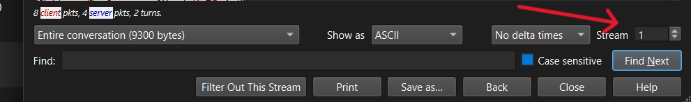
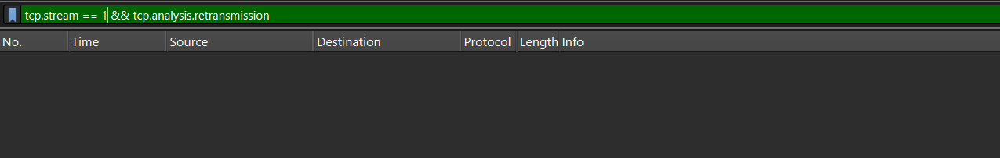
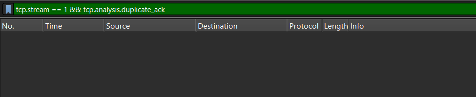
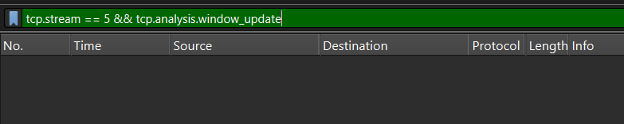
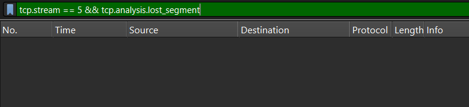

# Lab 9 – TCP File Download

* **TCP (Transmission Control Protocol)**

## Objective

Understand how TCP works by capturing and analyzing packets generated while downloading a small **PDF or ZIP file**.

The experiment focuses on understanding:

* **TCP Retransmissions**
* **Duplicate ACKs**
* **Window Updates**
* **Packet Loss**
* **Reliable delivery using TCP**

---

## Steps

1. Start **Wireshark**.

2. Select your active network interface:

   * **Wi-Fi** if you are using Wi-Fi.
   * **Ethernet** if you are using a wired connection.

3. Start the Wireshark capture.

4. Open a web browser.

5. Download a small **PDF or ZIP file**.

6. Wait until the download is completed.

7. Stop the Wireshark capture.

8. Apply the Display Filter:

   ```
   tcp
   ```

9. Find a TCP packet related to the file download.

10. Right-click on the packet and select:

```
Follow → TCP Stream
```

11. Note the **TCP stream number**.

For example:

```
Stream index: 5
```

12. Apply the following filter, replacing `5` with your actual stream number:

```
tcp.stream == 5
```

---

## Questions

1. Which **TCP stream** was used for the file download?
2. Were there any **TCP Retransmissions**?
3. Were there any **Duplicate ACKs**?
4. Were there any **Window Updates**?
5. Was there any **Packet Loss**?
6. How does TCP provide **reliable delivery**?

---

## Answers

### [1] Which TCP Stream was Used for the File Download?

* Apply the following display filter:

  ```
  tcp
  ```

* Locate a TCP packet related to the file download.

* Right-click the packet.

* Select:

  ```
  Follow → TCP Stream
  ```

* In the packet details, expand:

  ```
  Transmission Control Protocol
  ```

* Locate:

  ```
  Stream index
  ```

* Note the stream number.

  **Example:**

  ```
  Stream index: 5
  ```

* Now apply the following filter:

  ```
  tcp.stream == 5
  ```

* This displays the packets belonging to that particular TCP connection.

**Screenshot:**
<br/><br/> 

---

### [2] Were There Any TCP Retransmissions?

* Apply the following display filter:

  ```
  tcp.analysis.retransmission
  ```

* To check only your selected TCP stream, use:

  ```
  tcp.stream == N && tcp.analysis.retransmission
  ```

* Replace `N` with your actual TCP stream number.
* N=your stream number.
* In the packet list, look at the **Info** column.

* If a retransmission is detected, Wireshark may display:

  ```
  [TCP Retransmission]
  ```

* A retransmission means that TCP sent the same data again because the original data was not successfully acknowledged in the expected manner.

**Example:**

```text
Packet sent → Not successfully received/acknowledged
                    ↓
              TCP sends it again
                    ↓
                Retransmission
```

* If no packets are displayed, then no TCP retransmissions were detected.

**Screenshot:**
<br/><br/> 

---

### [3] Were There Any Duplicate ACKs?

* An **ACK (Acknowledgment)** tells the sender that data has been received.

* A **Duplicate ACK** occurs when the receiver repeatedly acknowledges the same sequence of data, often because a TCP segment is missing or has arrived out of order.

* Apply the following display filter:

  ```
  tcp.analysis.duplicate_ack
  ```

* To check only your TCP stream, use:

  ```
  tcp.stream == N && tcp.analysis.duplicate_ack
  ```

* Replace `N` with your actual stream number.

* Look at the **Info** column.

* Wireshark may display:

  ```
  [TCP Dup ACK]
  ```

* If packets are displayed, duplicate ACKs were observed.

* If no packets are displayed, no duplicate ACKs were detected.

**Screenshot:**
<br/><br/> 

---

### [4] Were There Any Window Updates?

* TCP uses a **window** to control how much data can be sent to the receiver.

* The receiver tells the sender how much data it can currently accept.

* This is called **TCP flow control**.

* Apply the following display filter:

  ```
  tcp.analysis.window_update
  ```

* To check only your TCP stream, use:

  ```
  tcp.stream == N && tcp.analysis.window_update
  ```

* Replace `N` with your actual stream number.

* In the packet list, look at the **Info** column.

* Wireshark may display:

  ```
  [TCP Window Update]
  ```

* A Window Update means that the receiver has changed the amount of data it can currently receive.

**Screenshot:**
<br/><br/> 

---

### [5] Was There Any Packet Loss?

* Packet loss occurs when a TCP segment does not successfully reach the destination.

* TCP can detect missing data using **sequence numbers and acknowledgments**.

* Apply the following display filter:

  ```
  tcp.analysis.lost_segment
  ```

* To check only your TCP stream, use:

  ```
  tcp.stream == N && tcp.analysis.lost_segment
  ```

* Replace `N` with your actual stream number.

* If packets are displayed, Wireshark has detected a possible lost segment.

* You can also check retransmissions using:

  ```
  tcp.stream == N && tcp.analysis.retransmission
  ```

* If you see a retransmission after a missing segment, it shows how TCP can recover from packet loss.

**Screenshot:**
<br/><br/> 

---

### [6] How Does TCP Provide Reliable Delivery?

TCP provides reliable delivery using several mechanisms.

#### 1. Sequence Numbers

TCP gives each piece of data a **sequence number**.

Sequence numbers help TCP know:

* Which data was received
* Which data is missing
* The correct order of the data

#### 2. Acknowledgments (ACKs)

The receiver sends an **ACK** to tell the sender that data has been received.

For example:

```text
Sender  ───────── Data ─────────>  Receiver
Sender  <──────── ACK ───────────  Receiver
```

#### 3. Retransmissions

If TCP detects that data was not successfully delivered, it can send the data again.

```text
Original packet
      ↓
Not acknowledged
      ↓
Packet sent again
      ↓
Retransmission
```

#### 4. Duplicate ACKs

Duplicate ACKs can indicate that the receiver is waiting for missing data.

TCP can use this information to detect possible packet loss.

#### 5. Window Updates

The TCP window controls how much data the sender can send before needing further acknowledgment.

This prevents the sender from sending more data than the receiver can handle.

---

## Important Display Filters

### To display all TCP packets:

```text
tcp
```

### To display a particular TCP stream:

```text
tcp.stream == 5
```

### To find retransmissions:

```text
tcp.analysis.retransmission
```

### To find duplicate ACKs:

```text
tcp.analysis.duplicate_ack
```

### To find window updates:

```text
tcp.analysis.window_update
```

### To find possible lost segments:

```text
tcp.analysis.lost_segment
```

### Retransmissions in your TCP stream:

```text
tcp.stream == 5 && tcp.analysis.retransmission
```

### Duplicate ACKs in your TCP stream:

```text
tcp.stream == 5 && tcp.analysis.duplicate_ack
```

### Window updates in your TCP stream:

```text
tcp.stream == 5 && tcp.analysis.window_update
```

### Lost segments in your TCP stream:

```text
tcp.stream == 5 && tcp.analysis.lost_segment
```

> **Note:** Replace `5` with your actual TCP stream number.

---

## Observation Table

| TCP Feature    | Wireshark Filter              | Result   |
| -------------- | ----------------------------- | -------- |
| TCP Stream     | `tcp.stream == 5`             | ______   |
| Retransmission | `tcp.analysis.retransmission` | Yes / No |
| Duplicate ACK  | `tcp.analysis.duplicate_ack`  | Yes / No |
| Window Update  | `tcp.analysis.window_update`  | Yes / No |
| Lost Segment   | `tcp.analysis.lost_segment`   | Yes / No |

---

## Learning

TCP (Transmission Control Protocol) is a **reliable transport protocol** used to deliver data between two devices.

When a file is downloaded, TCP divides the file into smaller segments and sends them to the receiver.

TCP uses **sequence numbers** to keep the data in the correct order and **ACKs** to confirm that the data has been received.

If some data is lost, TCP can use **duplicate ACKs and retransmissions** to detect and recover from the problem.

TCP also uses a **window size** to control how much data can be sent at one time.

By using Wireshark, we can observe these TCP mechanisms and understand how TCP provides **reliable delivery of data**.

## Conclusion

In this experiment, Wireshark was used to capture and analyze TCP packets generated during a file download. The TCP stream was identified using the `tcp.stream` filter. TCP analysis filters were then used to check for retransmissions, duplicate ACKs, window updates, and possible packet loss. This experiment helped demonstrate how TCP uses acknowledgments, sequence numbers, retransmissions, and flow control to provide reliable data delivery.
